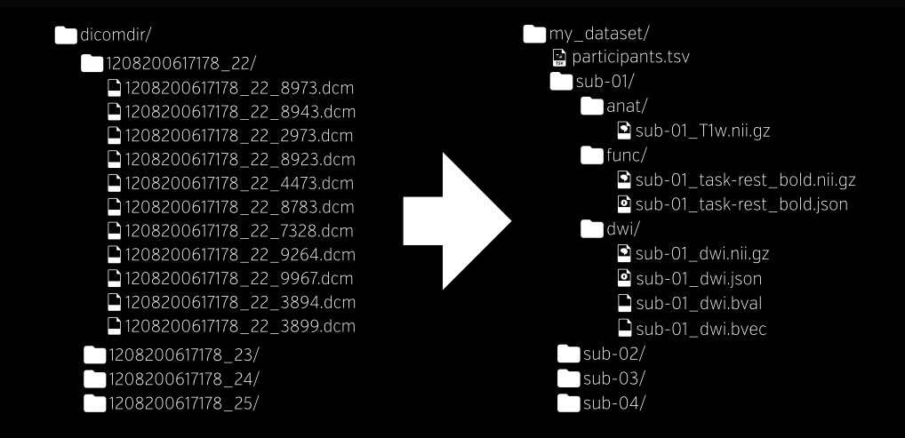

# Fung Lab Pipeline
 
## Before you get Started

### Overview
This demo will work locally, and use [Docker](https://docs.docker.com/engine/installation/) to run processing using [BIDS Apps](bids-apps.neuroimaging.io) to process the data. The reason we want to use these applications is because they are modular, developed in an open source fashion, and convert seamlessly to be run with [Singularity](http://singularity.lbl.gov) so the pipeline can easily be transferred to run at scale in a cluster environment.

### Dependencies
You should use python, preferably python 3. If you've never done this before, I recommend starting with [anaconda](https://www.continuum.io/downloads) and using [ipython](https://ipython.org/) which will give you tab completion on data structures to help learning. You can install dependencies as follows:

```
git clone https://github.com/researchapps/funglab.git
cd funglab
pip install -r requirements.txt
```

### General Tips
You should generally keep your code separate from your data, meaning that these scripts are in a version controlled (Github) repository, perhaps worked on collaboratively, and data is in a separate place. Generally with neuroimaging because there can be bugs along the way (e.g., errored registrations) you want to process a batch of data for one or more steps as a single job, and either do checks between the steps, or have automated checks print quality reports for you to check. Never move any data, open up a spreadsheet in excel, or do anything that is not programmatic, meaning it is reproducible.


## Original Pipeline
The Fung Lab is currently using [PMOD](http://www.pmod.com/web/), which has a variety of different tools that they sell as products. Specifically, they are using:

 - [PBAS](http://www.pmod.com/web/?portfolio=21-image-processing-pbas) (image processing and VOI analysis tool)
 - [PNEURO](http://www.pmod.com/web/?portfolio=31-automatic-analyses-pneuro) (tool for brain PET/MR analysis)
 - [PKIN](http://www.pmod.com/web/?portfolio=31-automatic-analyses-pneuro) (kinetic modeling tool).
 

### General procedure
The original general procedure goes something like this:
 
1. Obtain the DICOM files (T1 MRI and dynamic PET reconstruction) from the GE computer via a secure flash drive, then import them into the PMOD database. Using the view tool, run the motion correction function to average the frames with reference to the first four frames (1 minute for 15 second frames). 

2. Open the PNEURO tool and process the data. We start by selecting Hammer’s atlas in MNI space for our procedure. For a step by step guide please see the attached workbook, which will do a way better job at explaining the details that go into each step. Note: only pages 2-9 are relevant to our procedure.

3. At the end of the PNEURO processing, we obtain time activity curves (TACs), which we can transfer to the PKIN tool where we can apply a region-based model. PMOD has a variety of different kinetic models; however, we have been using a multilinear reference tissue based model by Ichise et al. We decided on this model by using the obtained AIC values for various regions from a few participants. Although, if you are able to incorporate some of these capabilities we might be able to compare a larger variety of models and potentially find a better one! We are using the pons as a reference region. You can find the reason why and the math used in the attached paper.

4. The BPnd values are one of the main things we are after. If you are able to obtain those, then perhaps we can compare our results?
 

## BIDS Pipeline
My first effort is going to be to try and use BIDS, the brain imaging data structure. 

### Convert Dicom to Nifti
There are many ways to do this, but the easiest is to just use [http://people.cas.sc.edu/rorden/mricron/install.html](http://people.cas.sc.edu/rorden/mricron/install.html).

After this step, the nifti files (.tar.gz) will each be in the same folder that the command was run from (sub-01/S1 and sub-01/S2). For the anatomical, there will be three files, something like this:

```
20170216_162102FLUMAZENILAUTISM020320s005a1001.nii.gz # original anatomical
co20170216_162102FLUMAZENILAUTISM020320s005a1001.nii.gz
o20170216_162102FLUMAZENILAUTISM020320s005a1001.nii.gz
```

and the pet will have one 4D sequence

```
20170216_162102s403a000.nii.gz  # PET data
```


### Organize into BIDS
The first step is to (programatically) organize the data into the [BIDS](http://bids.neuroimaging.io) format. You can see it looks like this:



This means that step 1 is to run [0.bids_convert.py](scripts/0.bids_convert.py). I've started this for you, with detailed steps along the way. I'd like you to try and reproduce these steps on your own, and then your task will be to generate the final json data structures before the dataset is completely BIDS-ified. Good luck, and please ping me if you have questions or run into trouble!
